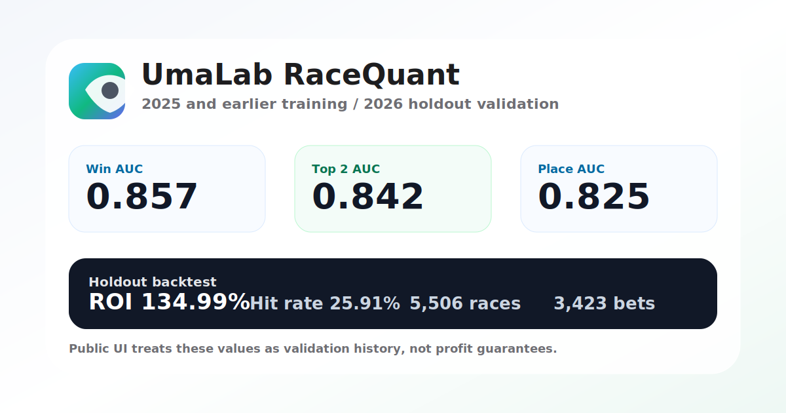

# UmaLab

UmaLab は、これから行われる競馬レースをAIで予測し、券種別の期待値、軍資金配分、バックテスト回収率、直前オッズ監視を一画面で扱う予想ワークベンチです。

利益保証や的中保証は目的にしません。過去データで検証した根拠を見ながら、買う/見送る判断を安定させるためのアプリです。



## Current Direction

- 複数AIモデル: win/place、着順分布、ticket EV、odds drift、ensemble
- 複数券種: 単勝、複勝、枠連、馬連、ワイド、馬単、3連複、3連単、WIN5
- カレンダー: 中央競馬と地方競馬を同じ画面で表示
- リスク/軍資金: スライダーと軍資金から購入点数、券種、金額を変更
- 実績: シミュレーション回収率、的中率、最大ドローダウンをWebに表示
- ライブ: パドック中から締切直前までオッズ変動を監視
- データ: `backend/data/keiba_data` の中央全レースCSVを学習元にする

詳細設計は [docs/architecture.md](docs/architecture.md) を参照してください。

## Directory

```text
app/                 Next.js UI
backend/app/         FastAPI, schemas, prediction logic
backend/scripts/     CSV変換、学習、バックテスト、SVG出力
backend/data/        ローカルデータ置き場（Git管理外）
backend/models/      学習済みモデル（Git管理外）
backend/backtests/   シミュレーション結果（Git管理外）
docs/                アプリ全体の設計メモ
```

## Frontend

```bash
npm install
npm run dev
```

http://localhost:3000 を開きます。

ローカルでバックエンドを別ポートに立てる場合は、フロント側にAPIの向き先を渡します:

```bash
NEXT_PUBLIC_API_BASE_URL=http://localhost:8000 npm run dev
```

## Backend With uv

```bash
cd backend
uv sync --extra dev
uv run uvicorn app.main:app --reload --port 8000
```

確認:

```bash
curl http://localhost:8000/health
curl http://localhost:8000/status
curl http://localhost:8000/status/product
curl http://localhost:8000/races
```

## Local Data Pipeline

中央の既存CSVを標準CSVへ変換:

```bash
cd backend
uv run python scripts/convert_keiba_data.py \
  --input-dir data/keiba_data \
  --output data/keiba_history_normalized.csv
```

学習:

```bash
uv run python scripts/train_production.py \
  --csv data/keiba_history_normalized.csv \
  --output-dir models/racequant
```

2025年までを学習、2026年を検証にする現在の本命モデル:

```bash
uv run python scripts/experiment_holdout_2026.py \
  --train-csv data/keiba_history_normalized.csv \
  --holdout-csv data/netkeiba_2026_normalized.csv \
  --output-dir models/racequant_holdout_2026
```

慎重に進める場合は、先に小規模ゲートを通します:

```bash
uv run python scripts/train_production.py \
  --csv data/keiba_history_normalized.csv \
  --output-dir models/racequant-smoke \
  --race-limit 500
```

出力の `quality_gate.publishable` が `true` になってからフル学習結果をWeb表示に使います。現在の学習は `place_odds`、走破タイム、上がりを直接特徴量に使わず、市場確率と履歴特徴量を使う構成です。

バックテスト:

```bash
uv run python scripts/backtest_simulator.py \
  --csv data/keiba_history_normalized.csv \
  --risk 72 \
  --bankroll 100000 \
  --output backtests/local-risk72.json
```

バックテストはデフォルトで `min_edge=0.12`、`min_probability=0.20`、`max_odds=40`、`max_edge=0.8` の保守的な購入フィルタを使います。`--skip-races` で学習期間の後ろだけを検証できます。

現在の `keiba_history_normalized.csv` には馬連・3連単などの公式払い戻し列がないため、デフォルトでは単勝・複勝のみを市場オッズベースで検証します。3連系まで仮オッズで試す場合だけ `--synthetic-exotics` を付けてください。

READMEや共有用のSVGカード出力:

```bash
uv run python scripts/render_prediction_card.py \
  --metrics models/racequant/metrics.json \
  --backtest backtests/local-risk72.json \
  --output ../public/model-output.svg
```

## Real Race Storage

実運用ではスクレイピング結果と予想履歴をSupabaseに保存します。Supabase SQL Editorで次を実行してください:

```bash
backend/docs/supabase_prediction_history.sql
```

Vercelには `SUPABASE_URL`、`SUPABASE_SERVICE_ROLE_KEY`、`CRON_SECRET` を設定します。Cronは `vercel.json` で毎日 `/api/jobs/ingest/netkeiba` を実行し、直近2日分のnetkeiba公開ページを低頻度で取得して `race_cards` にUpsertします。

## Vercel

このリポジトリは `vercel.json` の Services 構成で、Next.jsを `/`、FastAPIを `/api` に載せます。Vercelの Project Settings で Framework Preset を `Services` にしてから再デプロイしてください。

モデル本体はGitに入れません。Vercel Blobを接続して環境変数を取得した後、以下でアップロードします:

```bash
npm run upload:model -- backend/models/racequant_holdout_2026/holdout_artifact.joblib
```

出力された `RACEQUANT_MODEL_URL` と `RACEQUANT_MODEL_SHA256` をVercelのEnvironment Variablesに設定します。今後モデルを頻繁に差し替える場合は、`backend/model_registry.example.json` と同じ形式のJSONをBlobへ置き、`RACEQUANT_MODEL_MANIFEST_URL` だけを更新してください。フロントは本番では相対パス `/api` を使うため、`NEXT_PUBLIC_API_BASE_URL` は通常不要です。

## API Surface

- `GET /health`
- `GET /status`
- `GET /status/product`
- `GET /races?start_date=YYYY-MM-DD&end_date=YYYY-MM-DD`
- `GET /live/{race_id}`
- `GET /history`
- `GET /jobs/ingest/netkeiba`
- `POST /predict`
- `POST /predict/basic`
- `POST /ingest/csv`
- `POST /features/runners`
- `POST /train`
- `POST /jobs/sync`
- `POST /jobs/train`
- `POST /jobs/live-polling`

## Data Policy

`backend/data/**`, `backend/models/**`, `backend/backtests/**` はGit管理外です。`backend/data/keiba_data` の実データはローカル学習に使い、リポジトリへは載せません。

本番UIでデモレースを本物として表示しないため、`/races` は検証済みCSVまたは同梱スナップショットから作ったレースだけを返します。過去予想を永続化する場合は `backend/docs/supabase_prediction_history.sql` をSupabaseで実行し、`SUPABASE_URL` と `SUPABASE_SERVICE_ROLE_KEY` をVercelに設定してください。
